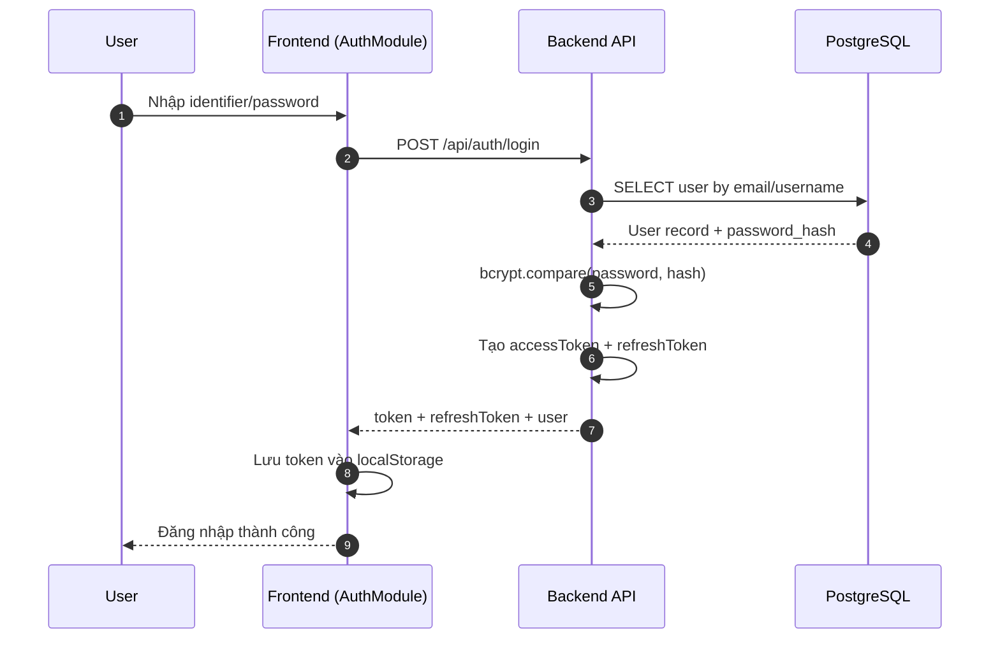
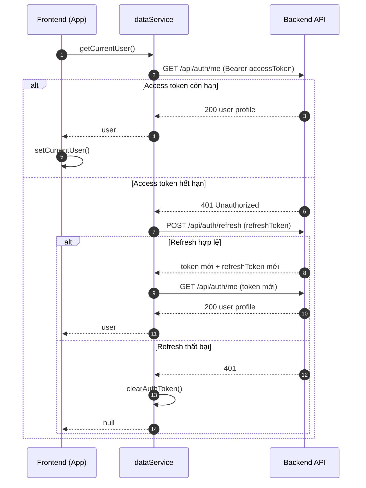
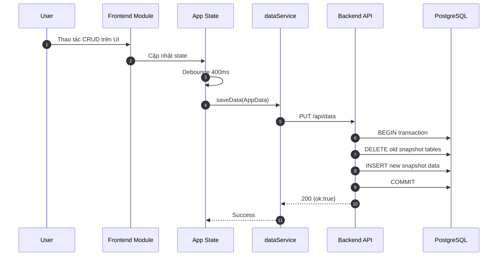
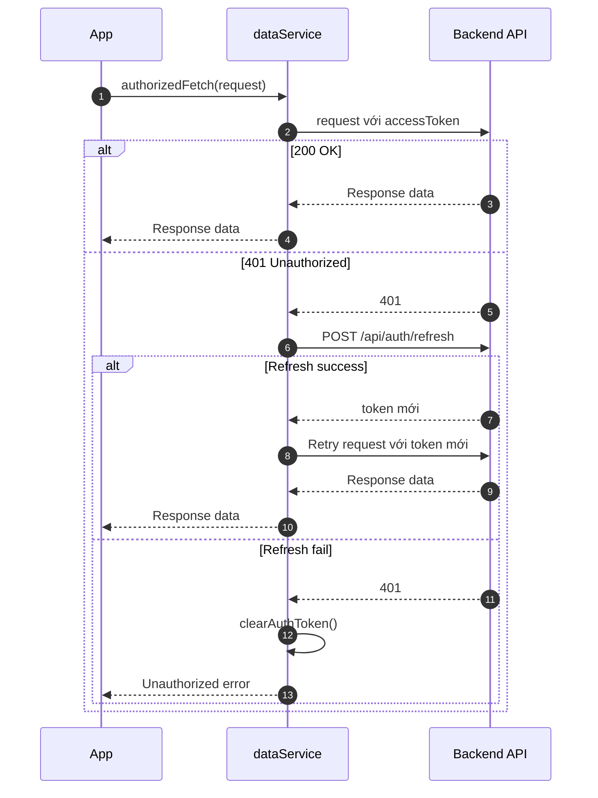

# Sequence Diagram - CinemaHub

Tài liệu này mô tả các luồng xử lý chính của hệ thống bằng Mermaid.

## 1. Luồng đăng nhập

## 2. Luồng khôi phục phiên sau reload

## 3. Luồng lưu dữ liệu snapshot

## 4. Luồng refresh token khi gọi API protected

